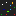

# [NetMons ](https://netmons.net)

*A Monster-Tamagotchi-like at best, a digital goldfish at worst.*

## Features

* Command your Mon around or let it stroll!
* Eat items to e- or de-volve!
* Call over friends by picking up a phone and entering their NetMons URL!
* If all fails, just enjoy the beautiful landscape at day and night!

## GGJ2022 

This game's development started with GGJ2022 and I intend to grow it further!

Theme: **duality**

[Diversifiers](https://globalgamejam.org/news/ggj-2022-diversifiers):

* [GAG10](http://www.gameaccessibilityguidelines.com/):
    * [x] [Every action is possible via mouse click/touch, only phone commands require keyboard](https://gameaccessibilityguidelines.com/ensure-that-all-areas-of-the-user-interface-can-be-accessed-using-the-same-input-method-as-the-gameplay/)
    * [x] [Support mouse and touch](http://gameaccessibilityguidelines.com/support-more-than-one-input-device)
    * [x] [No simultaneous inputs needed](http://gameaccessibilityguidelines.com/ensure-that-multiple-simultaneous-actions-eg-clickdrag-or-swipe-are-not-required-and-included-only-as-a-supplementary-alternative-input-method)
    * [x] [Plays in both portrait and landscape](http://gameaccessibilityguidelines.com/allow-play-in-both-landscape-and-portrait)
    * [x] [Can be played windowed and fullscreen](http://gameaccessibilityguidelines.com/if-producing-a-pc-game-support-windowed-mode-for-compatibility-with-overlaid-virtual-keyboards)
    * [x] [Game starts right away](http://gameaccessibilityguidelines.com/allow-the-game-to-be-started-without-the-need-to-navigate-through-multiple-levels-of-menus)
    * [x] [No blood, no gore (but pixelized red steaks!)](http://gameaccessibilityguidelines.com/provide-an-option-to-disable-blood-and-gore/)
    * [x] [No essential info via sound alone](http://gameaccessibilityguidelines.com/ensure-no-essential-information-is-conveyed-by-sounds-alone)
    * [x] [No speech input required](http://gameaccessibilityguidelines.com/ensure-that-speech-input-is-not-required-and-included-only-as-a-supplementary-alternative-input-method)
    * [x] [Game state is auto-saved in URL](http://gameaccessibilityguidelines.com/provide-an-autosave-feature)
* 20th Century Gaming (inspired by 1990s Tamagotchi and monster games)
* Take A Break

Inspiration:

* https://digimon.fandom.com/wiki/Digimon_Virtual_Pet
* https://www.pokewiki.de/Pok%C3%A9mon_Pikachu
* https://github.com/kitao/pyxel#color-palette

### Backlog 

Battle system:

* Battle item spawn
* Battle start via URL prompt
* Attack art
* Tab events to attacks (melee/range)
* Balance

Bonding, chores, mood:

* ? 💩 support
* ? Happiness support

Further:

* ? Friend interaction
* ? More Mons
* ? More phone commands
* ? Title screen + logo

**Mon ideas**

*Botmon*

* A bot with a cape?

*Piggu*, *Froggu*

* Pig-/frog-likes?

### Technicalities 

The game's resolution is 240x240 px, so it could be ported to hackable wearables like [banglejs](https://banglejs.com/).
All assets are created for half the screen size (120x120 px) and scaled up to twice their size.
This opens two options:

1. Target smaller screens (below 240x240 px), at minimum of 120x120 px size, by not using the scaled up assets (`su*.png`) and reducing `BASE_SIZE` from 240 to 120.
2. Support higher fidelity assets. All items are currently 8x8 px, all Mons are 16x16 px and scaled up to 16x16 px and 32x32 px respectively.
  Assets could be overwritten to e.g. use 32x32 Mon sprites with more detail.

## Credits 

* [Oliver "oz" Z.](https://oliz.io)

## Privacy, Disclaimer and Legal 💩

* The game does not set any cookies, it does not track you and it does not want your personal data. You cannot comment on anything or signup for a newsletter.
* The game is hosted on GitHub (Microsoft), see their terms and policies
* The game fetches dependencies from cdn.jsdelivr.net, see their terms and policies
* If a certain optional game feature is used, the game may embed music from youtube-nocookie.com, see their terms and policies
* If a certain optional game feature is used, the game may redirect to youtube.com, see their terms and policies

The game may contain links to external websites or services. These links are being provided as a convenience and for informational purposes only; they do not constitute an endorsement or an approval by myself of any of the products, services or opinions of the corporation or organization or individual. I bear no responsibility for the accuracy, legality or content of the external site or for that of subsequent links. Contact the external site for answers to questions regarding its content.

## License

Copyright © 2022 Oliver "oz" Z.

* AGPLv3 for all code, see [LICENSE.txt](LICENSE.txt) for details
* All other content (texts, images, names): <a rel="license" href="https://creativecommons.org/licenses/by-sa/4.0/">Creative Commons Attribution-ShareAlike 4.0 International License</a>

  
