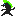

# [NetMons ](https://netmons.net)

*A Monster-Tamagotchi-like at best, a digital goldfish at worst.*

## Backlog 

Battle system:

* Battle item spawn
* Battle start via URL prompt
* Attack art
* Tab events to attacks (melee/range)
* Balance

Bonding, chores, mood:

* ? 💩 support
* ? Happiness support

Further:

* ? Friend interaction
* ? More Mons
* ? More phone commands
* ? Title screen + logo

## GGJ2022 

Theme: **duality**

* ... of you and your opponent
* ... of you and a friend
* ... of a Mon and its evolution
* ... of balanced Mon nutrition
* ... of day and night
* ... of Mon types and attacks
* ... of happiness and sadness

[Diversifiers](https://globalgamejam.org/news/ggj-2022-diversifiers):

* [GAG10](http://www.gameaccessibilityguidelines.com/):
    * [x] [Every action is possible via mouse click/touch, only phone commands require keyboard](https://gameaccessibilityguidelines.com/ensure-that-all-areas-of-the-user-interface-can-be-accessed-using-the-same-input-method-as-the-gameplay/)
    * [x] [Support mouse and touch](http://gameaccessibilityguidelines.com/support-more-than-one-input-device)
    * [x] [No simultaneous inputs needed](http://gameaccessibilityguidelines.com/ensure-that-multiple-simultaneous-actions-eg-clickdrag-or-swipe-are-not-required-and-included-only-as-a-supplementary-alternative-input-method)
    * [x] [Plays in both portrait and landscape](http://gameaccessibilityguidelines.com/allow-play-in-both-landscape-and-portrait)
    * [x] [Can be played windowed and fullscreen](http://gameaccessibilityguidelines.com/if-producing-a-pc-game-support-windowed-mode-for-compatibility-with-overlaid-virtual-keyboards)
    * [x] [Game starts right away](http://gameaccessibilityguidelines.com/allow-the-game-to-be-started-without-the-need-to-navigate-through-multiple-levels-of-menus)
    * [x] [No blood, no gore (but pixelized red steaks!)](http://gameaccessibilityguidelines.com/provide-an-option-to-disable-blood-and-gore/)
    * [x] [No essential info via sound alone](http://gameaccessibilityguidelines.com/ensure-no-essential-information-is-conveyed-by-sounds-alone)
    * [x] [No speech input required](http://gameaccessibilityguidelines.com/ensure-that-speech-input-is-not-required-and-included-only-as-a-supplementary-alternative-input-method)
    * [x] [Game state is auto-saved in URL](http://gameaccessibilityguidelines.com/provide-an-autosave-feature)
* 20th Century Gaming (inspired by 1990s Tamagotchi and monster games)
* Take A Break

Inspiration:

* https://digimon.fandom.com/wiki/Digimon_Virtual_Pet
* https://www.pokewiki.de/Pok%C3%A9mon_Pikachu
* https://github.com/kitao/pyxel#color-palette

## Credits 

* [Oliver "oz" Z.](https://oliz.io)

## License

Copyright © 2022 Oliver "oz" Z.

* AGPLv3 for all code, see [LICENSE.txt](LICENSE.txt) for details
* All other content (texts, images, names): <a rel="license" href="https://creativecommons.org/licenses/by-sa/4.0/">Creative Commons Attribution-ShareAlike 4.0 International License</a>

  
